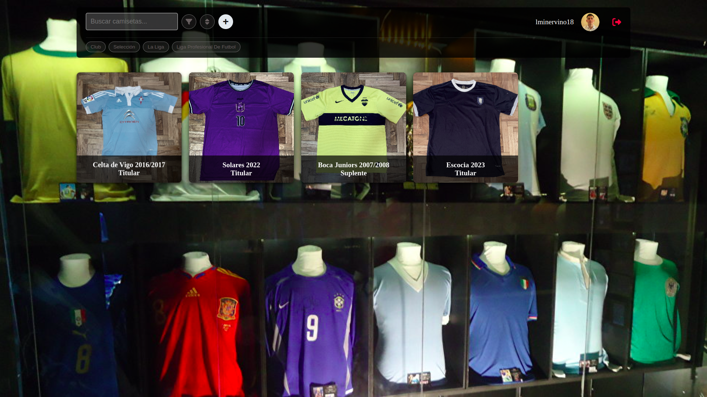
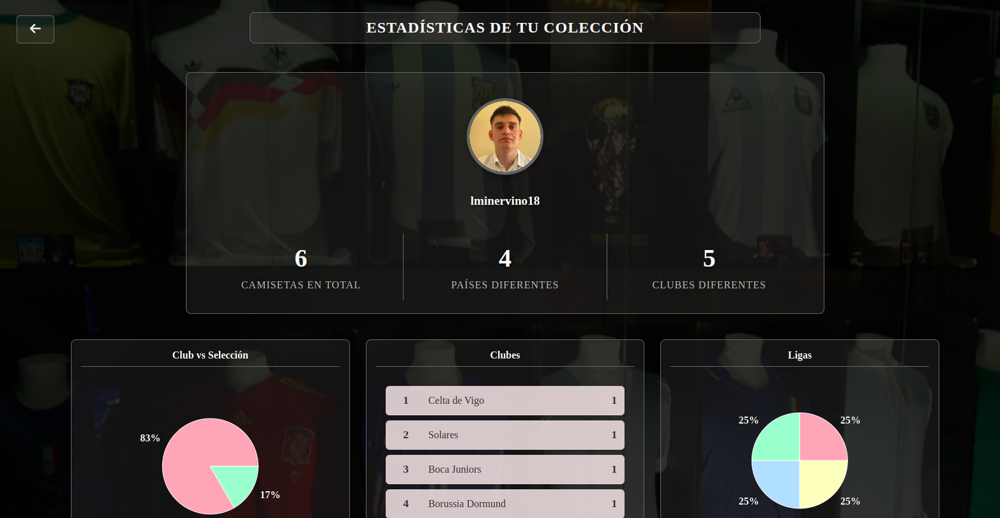
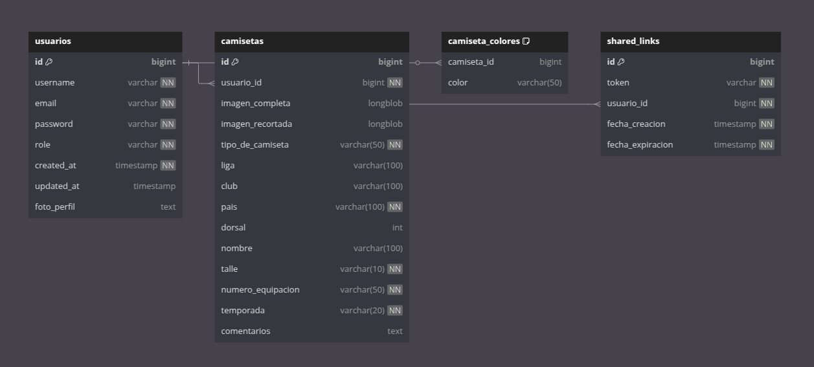

# Mi Colección de Camisetas

**Mi Colección de Camisetas** es una aplicación web diseñada para gestionar un inventario personalizado de camisetas de fútbol. La plataforma permite a los usuarios almacenar y organizar su colección personal, con características como subir imágenes, añadir información detallada de cada camiseta y realizar consultas de manera eficiente.




## Tecnologías utilizadas

### Frontend
- **React**: Usado para construir una interfaz de usuario moderna y responsiva
- **CSS**: Para estilizar y diseñar la interfaz

### Backend
- **Spring Boot**: Framework de Java para construir aplicaciones backend escalables y seguras
- **Maven**: Para gestión de dependencias y construcción del proyecto

### Base de datos
- **MySQL**: Base de datos relacional para almacenar usuarios y camisetas

## Modelo de Base de Datos

El siguiente diagrama muestra la estructura de la base de datos:

)

### Estructura de Tablas

#### Usuarios
- `id`: Identificador único
- `username`: Nombre de usuario (único)
- `email`: Correo electrónico (único)
- `password`: Contraseña encriptada
- `role`: Rol del usuario (ADMIN/USER)
- `created_at`: Fecha de creación
- `updated_at`: Fecha de última actualización
- `foto_perfil`: Foto de perfil en formato base64

#### Camisetas
- `id`: Identificador único
- `usuario_id`: ID del usuario propietario
- `imagen_completa`: Imagen completa de la camiseta
- `imagen_recortada`: Miniatura de la camiseta
- `tipo_de_camiseta`: Club o Selección
- `liga`: Liga a la que pertenece (opcional)
- `club`: Nombre del club (opcional)
- `pais`: País de la camiseta
- `dorsal`: Número de la camiseta (opcional)
- `nombre`: Nombre en la camiseta (opcional)
- `talle`: Talle de la camiseta
- `numero_equipacion`: Tipo de equipación
- `temporada`: Temporada de la camiseta
- `comentarios`: Comentarios adicionales

#### Enlaces Compartidos
- `id`: Identificador único
- `token`: Token único para compartir
- `usuario_id`: ID del usuario que comparte
- `fecha_creacion`: Fecha de creación del enlace
- `fecha_expiracion`: Fecha de expiración del enlace


## Funcionalidades principales

### Gestión de Usuarios
- Registro y autenticación
- Actualización de perfil
- Gestión de foto de perfil

### Gestión de Camisetas
- Agregar nuevas camisetas con imágenes
- Editar información de camisetas existentes
- Eliminar camisetas
- Filtrar y ordenar camisetas
- Visualización en formato grilla

### Estadísticas y Análisis

La funcionalidad estrella de la aplicación es su sección de estadísticas, que proporciona:

- Distribución de camisetas por liga/país
- Análisis temporal de la colección
- Gráficos interactivos de composición de la colección
- Tendencias de colores y equipaciones

Esta sección permite a los usuarios obtener insights valiosos sobre su colección y comprender mejor sus preferencias y patrones de coleccionismo.

## Configuración y Ejecución

### Requisitos previos
- Java 17 o superior
- Node.js y npm
- MySQL

### Ejecución Automática

```bash
./run_all.sh
```

Este script inicia automáticamente:

- Servidor MySQL local
- Backend Spring Boot
- Frontend React

### Ejecución Manual

Backend
BASH

```
cd backend
mvn spring-boot:run
 ```

Frontend
BASH

```
cd frontend
npm install
npm start
```

Base de datos
- Crear una base de datos MySQL
- Configurar las credenciales en application.properties

### Notas de seguridad
- Contraseñas encriptadas
- Autenticación mediante JWT
- Validación de datos en frontend y backend
