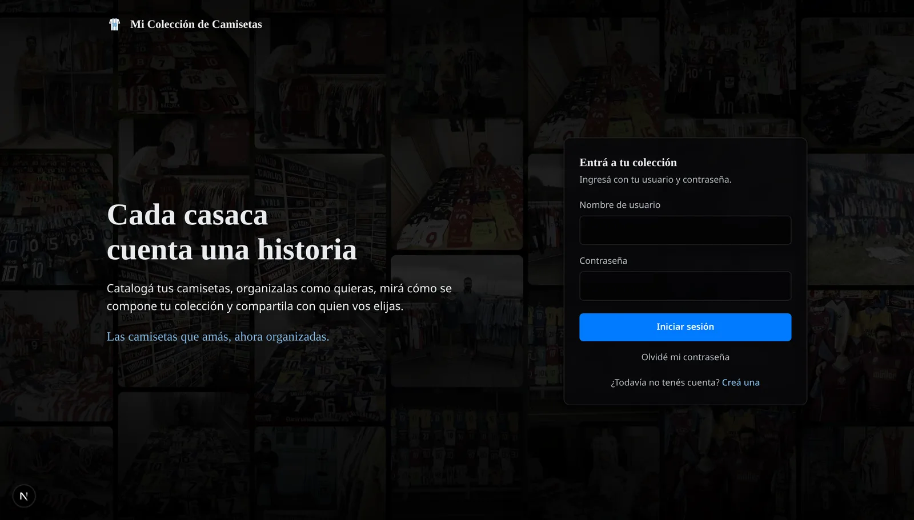

# Mi Colección de Camisetas

Catalogue, organise and share a personal football shirt collection.



## Stack

Next.js · TypeScript · PostgreSQL · Drizzle · Tailwind CSS

## Running it locally

Requires Node.js 20.11+, pnpm 10 and Docker.

```bash
pnpm install
docker compose up -d
cp env.example apps/web/.env.local
pnpm db:migrate
pnpm db:seed
pnpm dev
```

Open http://localhost:3000 and sign in as `coleccionista` with the password
`una-contrasena-larga`.

No external accounts are needed: images are stored on disk and password reset emails are written
to the server log with a working link.

## Other commands

```bash
pnpm test        # unit and integration tests
pnpm test:e2e    # end-to-end tests
pnpm lint
pnpm typecheck
pnpm build
```

## Documentation

Everything else lives in [`docs/`](docs/): architecture, decisions, testing, environment variables
and deployment. The rebuild itself is written up in [`docs/rebuild-report.md`](docs/rebuild-report.md).
